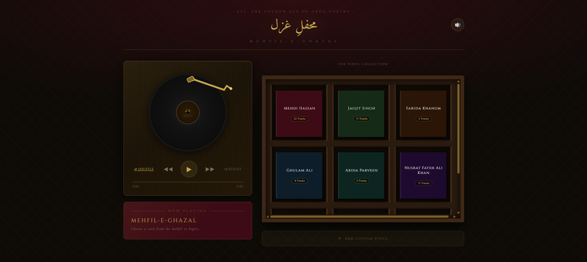

# Ghazalpaglu - A Vinyl Record Player for Ghazal Music

A beautifully designed web application for exploring and listening to classic Ghazal music. Ghazalpaglu combines nostalgic vinyl record player aesthetics with modern web technology to create an immersive listening experience for lovers of classical Urdu poetry and music.

## Features

- **Curated Ghazal Library**: Pre-loaded collection of classic ghazals from legendary artists including:
  - Mehdi Hassan
  - Jagjit Singh
  - And many more

- **Vinyl Record Player UI**: Immersive retro design featuring:
  - Animated CD/vinyl records
  - Tone arm with needle animation
  - Ambient room ambiance
  - CD rack for browsing your collection

- **Playback Controls**:
  - Play/pause functionality
  - Shuffle and repeat modes
  - Volume control with slider
  - Progress tracking with time display
  - Seek functionality

- **Playlist Management**:
  - Add custom ghazals via YouTube links
  - Persistent local storage of custom additions
  - Artist-based browsing and filtering
  - Search functionality by artist

- **Responsive Design**:
  - Mobile-friendly interface
  - Beautiful gradient backgrounds with custom color schemes
  - Smooth animations powered by Framer Motion

## Tech Stack

- **Frontend Framework**: React 19
- **Build Tool**: Vite
- **Styling**: Tailwind CSS + PostCSS
- **Audio Playback**: Howler.js (with React Player support)
- **Animations**: Framer Motion
- **Icons**: Lucide React
- **Linting**: ESLint

## Getting Started

### Prerequisites
- Node.js (v16 or higher)
- npm or yarn

### Installation

1. Clone the repository:
```bash
git clone https://github.com/Manha27/ghazalpaglu.git
cd ghazalpaglu
```

2. Install dependencies:
```bash
npm install
```

3. Start the development server:
```bash
npm run dev
```

The application will open at `http://localhost:5173/` (or the next available port).

## Available Scripts

- `npm run dev` - Start the development server with hot reload
- `npm run build` - Build the application for production
- `npm run preview` - Preview the production build locally
- `npm run lint` - Run ESLint to check code quality

## Project Structure

```
src/
├── components/           # React components
│   ├── AmbientRoom.jsx  # Background ambiance element
│   ├── CDPlayer.jsx     # Main player controls
│   ├── CDRack.jsx       # Record collection display
│   ├── CustomVinylInput.jsx  # Form for adding custom tracks
│   ├── NeedleArm.jsx    # Animated tone arm
│   └── NowPlaying.jsx   # Currently playing track display
├── data/
│   ├── ghazals.js       # Ghazal metadata and information
│   └── playlist.js      # Pre-loaded playlist with curated tracks
├── App.jsx              # Main application component
├── main.jsx             # Application entry point
└── App.css / index.css  # Global styles
```

## How to Use

1. **Browse Ghazals**: The main interface displays the vinyl record player with the current track
2. **Play Music**: Click the play button to start listening
3. **Control Playback**: Use the playback controls for shuffle, repeat, and volume
4. **Search by Artist**: Filter songs by clicking on artist names in the sidebar
5. **Add Custom Tracks**: Use the "Add Vinyl" feature to insert YouTube links to your favorite ghazals
6. **Persistent Playlist**: Your custom additions are automatically saved to your browser

## Customization

The application uses custom color schemes for different artists. Colors are defined in:
- `src/App.jsx` - Main color palette
- Individual track data - Per-track color assignments
- Tailwind configuration for theme colors

## Data Format

Ghazals in the playlist follow this structure:
```javascript
{
  urduArtist: "Artist Name in Urdu",
  artistEn: "Artist Name in English",
  urduSong: "Song Title in Urdu",
  songEn: "Song Title in English",
  color: "#HexColor",
  id: "YouTubeVideoId",
  type: "yt"
}
```
## Preview


## About Ghazal Music

Ghazal is a form of Urdu and Persian poetry and music that has been part of South Asian classical music tradition for centuries. Each ghazal is a poetic form consisting of rhyming couplets and a refrain, with each verse being independent yet musically and thematically connected. This application celebrates the timeless beauty of this art form.

## License

This project is open source and available under the MIT License.

## Contributing

Contributions are welcome! Whether it's adding new ghazals, improving the UI, or fixing bugs, feel free to submit a pull request.

## Contact & Support

For questions, suggestions, or issues, please open an issue on the GitHub repository.

---

Made with love for lovers of classical music and poetry.
